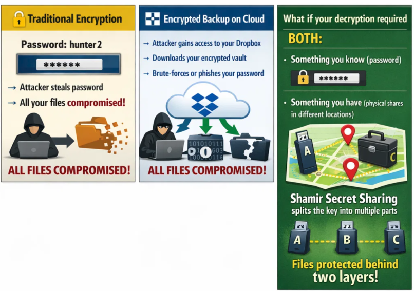
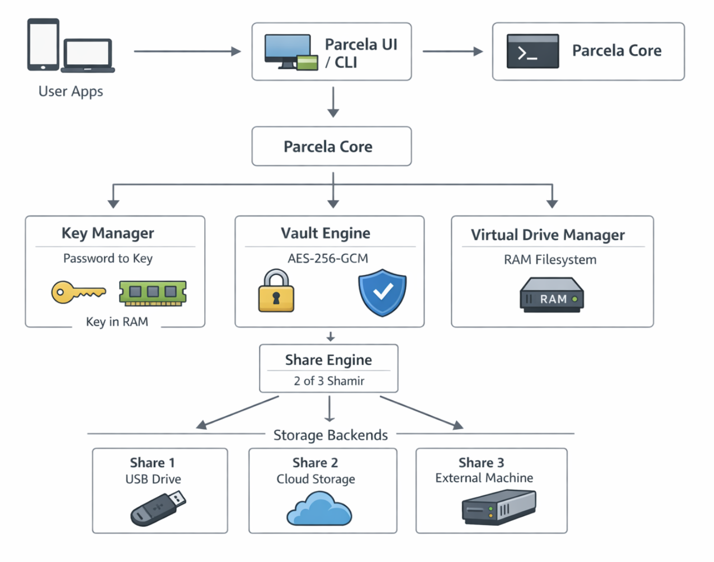

<p align="center">
  
</p>

<h1 align="center">Parcela</h1>

<p align="center">
  <strong>Split-key encryption vault for maximum security</strong><br>
  Your files require <em>both</em> your password <em>and</em> physical possession of shares to decrypt.
</p>

<p align="center">
  
  
  
</p>

<p align="center">
  <video src="docs/assets/parcela-demo.mp4" width="600" autoplay loop muted playsinline>
    Your browser doesn't support video. <a href="docs/assets/parcela-demo.mp4">Download the demo</a>.
  </video>
</p>

---

## Why Parcela?

Traditional encryption has a single point of failure: **steal the password, steal the data.**

Parcela eliminates this by requiring **two things** to decrypt:

| Attack Scenario | Traditional Encryption | Parcela |
|-----------------|----------------------|---------|
| Attacker steals your password | ❌ Data compromised | ✅ Safe — they need shares too |
| Attacker steals your files | ❌ Can brute-force password | ✅ Safe — shares are useless alone |
| Attacker steals 1 share | — | ✅ Safe — need 2 of 3 shares |

<p align="center">
  
</p>

### How It Works

1. **Encrypt** — Your file is encrypted with AES-256-GCM using your password
2. **Split** — The encrypted blob is split into 3 shares (any 2 can reconstruct it)
3. **Distribute** — Store shares in different locations (USB, cloud, safe)
4. **Recover** — Combine any 2 shares + your password to decrypt

<p align="center">
  
</p>

---

## Quick Start

### Download

Get the latest release for your platform:

👉 **[Download Parcela](../../releases/latest)** (Windows / macOS / Linux)

### Or Build From Source

```bash
# Install Tauri CLI
cargo install tauri-cli --version "^2"

# Run the app
cargo tauri dev
```

---

## Features

| Feature | Description |
|---------|-------------|
| 🔐 **2-of-3 Secret Sharing** | Split files into 3 shares — any 2 can recover the original |
| 🛡️ **AES-256-GCM Encryption** | Military-grade authenticated encryption |
| 💾 **Virtual Drive** | RAM-backed encrypted filesystem — browse in your file manager |
| 🖥️ **Cross-Platform GUI** | Native desktop app for Windows, macOS, and Linux |
| ⌨️ **CLI Support** | Full command-line interface for automation |

### Virtual Drive

The virtual drive feature creates a browsable encrypted filesystem:

- **Windows**: Uses [WinFsp](https://winfsp.dev/) to mount as a real drive letter (e.g., `P:\`)
- **macOS/Linux**: Uses a tmpfs-backed directory in `/tmp`

Files exist only in RAM — nothing is written to disk unencrypted.

> **Note**: On Windows, install WinFsp for the best experience. Without it, a built-in file browser is used instead.

---

## CLI Usage

**Split a file into shares:**

```bash
parcela split \
  --input /path/to/secret.txt \
  --out-dir /path/to/shares \
  --password "your-passphrase"
```

Creates: `secret.txt.share1`, `secret.txt.share2`, `secret.txt.share3`

**Recover from any 2 shares:**

```bash
parcela combine \
  --shares /path/to/secret.txt.share1 /path/to/secret.txt.share3 \
  --output /path/to/recovered.txt \
  --password "your-passphrase"
```

---

## Use Cases

- 🏦 **Estate Planning** — Split crypto wallet keys between family members
- 🔑 **Password Backup** — Store master passwords with geographic redundancy  
- 📁 **Sensitive Documents** — Legal, medical, or financial records
- 🏢 **Corporate Secrets** — Require multiple executives to decrypt

---

<details>
<summary><strong>📦 Building & Development</strong></summary>

### Run Tests

```bash
cargo test
```

### Build Release

```bash
cargo tauri build
```

Output: `src-tauri/target/release/bundle/`

### Release Process

1. Update version in `src-tauri/tauri.conf.json`
2. Commit and push changes
3. Create and push a version tag:
   ```bash
   git tag v0.1.0 && git push origin v0.1.0
   ```
4. GitHub Actions builds installers for all platforms
5. Publish the draft release on GitHub

### Code Signing

| Platform | Notes |
|----------|-------|
| Windows | Unsigned installers trigger SmartScreen. Use Authenticode (EV recommended) for production. |
| macOS | Notarization required. Needs Apple Developer ID + `notarytool`. |
| Linux | Provide SHA-256 checksums on the release page. |

</details>

<details>
<summary><strong>🔧 Technical Specification</strong></summary>

### Cryptography

- **Encryption:** AES-256-GCM (authenticated encryption)
- **Key Derivation:** Argon2id (64 MiB memory, 3 iterations, 4 lanes) — ~2s on modern hardware
- **Secret Sharing:** 2-of-3 threshold scheme

### File Format (v2)

**Encrypted Blob:**
```
PARCELA2     (8 bytes magic)
<salt>       (32 bytes, random for Argon2id)
<nonce>      (12 bytes)
<ciphertext> (AES-256-GCM encrypted data)
```

> **Note:** Legacy PARCELA1 files (SHA-256 key derivation) are still readable for backwards compatibility.

**Share File:**
```
PSHARE01     (8 bytes magic)
<index>      (1 byte: 1, 2, or 3)
<total>      (1 byte: 3)
<threshold>  (1 byte: 2)
<length>     (4 bytes, big-endian)
<payload>    (length bytes)
```

</details>

---

<p align="center">
  <sub>Built with 🦀 Rust + Tauri</sub>
</p>
